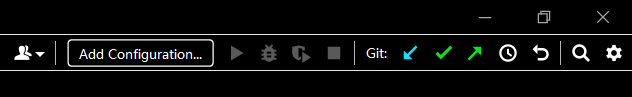

# dg_crawler_website_pub

数据部-新闻爬虫收集仓库(public)

## 提交说明

参考这篇博客————[Git&Github从精通到不会](https://zhuanlan.zhihu.com/p/392095155)

配置好Git环境、ssh、pycharm+Git。

接着可以提交你的爬虫代码：

1. `git pull` # 有时需要先把远程仓库的爬虫更新到本地。
2. 将爬虫文件复制到spiders文件夹下。
3. `git add`
4. `git commit -m "liu ding qian"` #引号里面是对本次提交的一个评论，需要注明爬虫作者和提交原因。
5. `git push` #推送到远程仓库

或者采用Pycharm里面的图形工具，来`pull add commit push`

参考这篇博客————[Pycharm | 使用自带的git图形工具push代码](https://blog.csdn.net/m0_46156900/article/details/121857440)
___
持续更新中...
